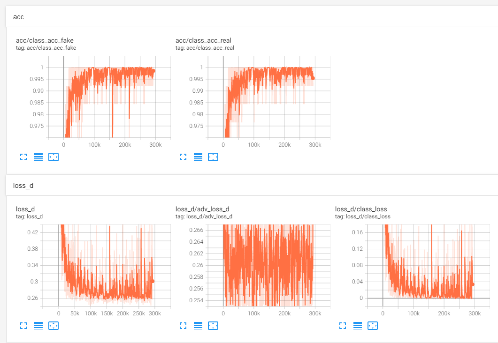
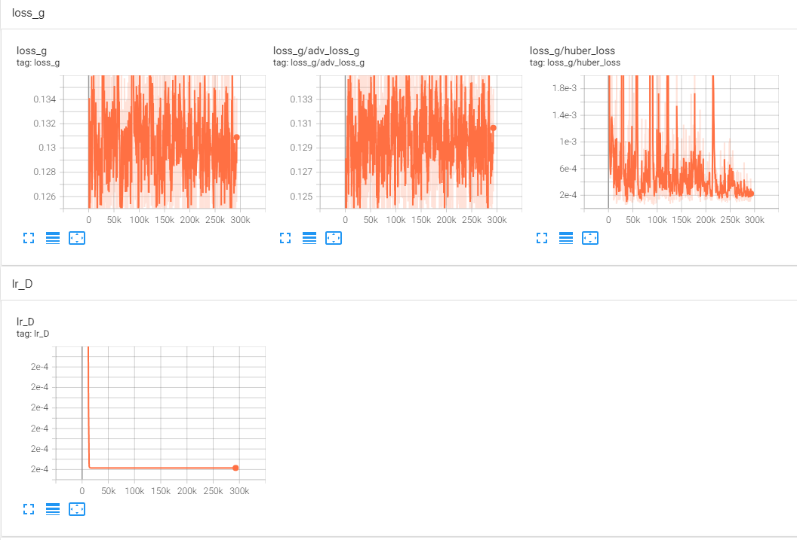
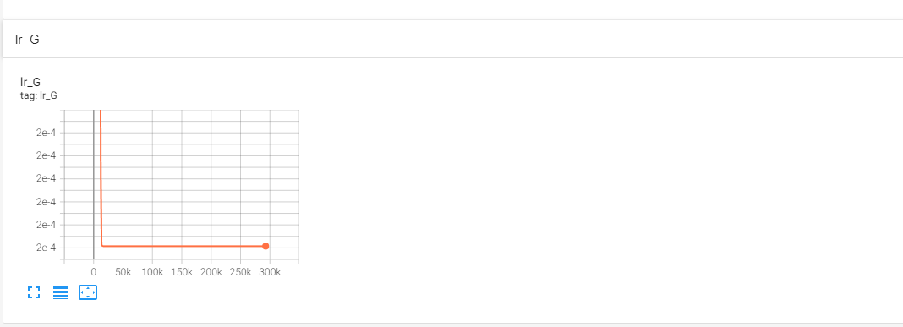
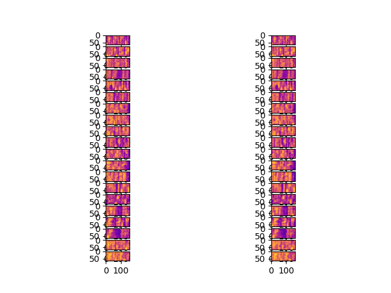

## Introduction ##

This repository is about paper SpeakerGAN , and is unofficially implemented by Mingming Huang (dyyzhmm@163.com), Tiezheng Wang (wtz920729@163.com) and thanks for advice from TongFeng.

## SpeakerGAN paper ##

SpeakerGAN: [Speaker identification with conditional generative adversarial network](https://www.researchgate.net/publication/344057150_SpeakerGAN_Speaker_Identification_with_Conditional_Generative_Adversarial_Network)， by Liyang Chen , Yifeng Liu , Wendong Xiao , Yingxue Wang ,Haiyong Xie.

## Usage ##
Step 1: for vad preprocess.
    
    $python vad.py filelist_with_absolute_path   #It will get vad file saved in the same directory with '_vad' for filename.
    $cat filelist_with_absolute_path
    /datasdc/librispeech/train-clean-100/458/126305/458-126305-0041.wav
    /datasdc/librispeech/train-clean-100/4051/11218/4051-11218-0009.wav
    /datasdc/librispeech/train-clean-100/7635/105409/7635-105409-0022.wav
    .
    .
    .

Step 2: for train / test / generate: 

	python speakergan.py  #You may need to change the path of vad preprocessed wav files.

It costs us about 65 hours to train on NVIDIA Ampere A100 1 card with help of redis cache.
    
## Our results ##

	acc: 98.1955% on testset. Fixed first 1.6 seconds on testset, model/2200_D.pkl.
    

    
   
   

Generated samples with Generator on model/2200_G.pkl:
   
    
## Details of paper ##

The following are details about this paper.

================ input ==================

1. feature: fbank, 8000hz, 25ms frame, 10ms overlap. shape:(160,64)

2. dataset: librispeech-100 train-clean-100  POI:251

3. data preprocess:  vad、mean and variance normalization, shuffled.

4. 60% train. 40% test.

================ model architecture ==================

1. dataflow: data -> feature extraction -> G & D

2. model architecture:

      G: gated CNN, encoder-decoder, Huber loss + adversarial loss
   
      D: ResnetBlocks, template average pooling, FC, softmax, crossentropy loss + adversarial loss

3. G: shuffler layer, GLU

4. D: ReLU

================ training ==================

1. lr: 0-9, 0.0005 | 9-49, 0.0002

2. L(d): λ1 λ2 = 1

3. batch_size: 128 # diff with paper.

4. epoch: 2200 #diff with paper

5. D_train steps / G_train steps = 4

6. Ladv Loss: Label smoothing, 1 -> 0.7 ~ 1.0, 0 -> 0 ~ 0.3

======== not sure or differences with paper ========

1. weights,bias initialize function, we use: xavier_uniform and zeros

2. pytorch huber_loss.

3. for shorter wav, paper: padded with zero. we: padded with feature again.

4. gated cnn architecture.

5. we use webrtcvad mode(3) for vad preprocess.

6. **Paper error 1**: we think the paper missing a plus sign in formula (5)

7. **Paper error 2**: we think the structure of conv6 in Generator is wrong, the output channel should be 64.

